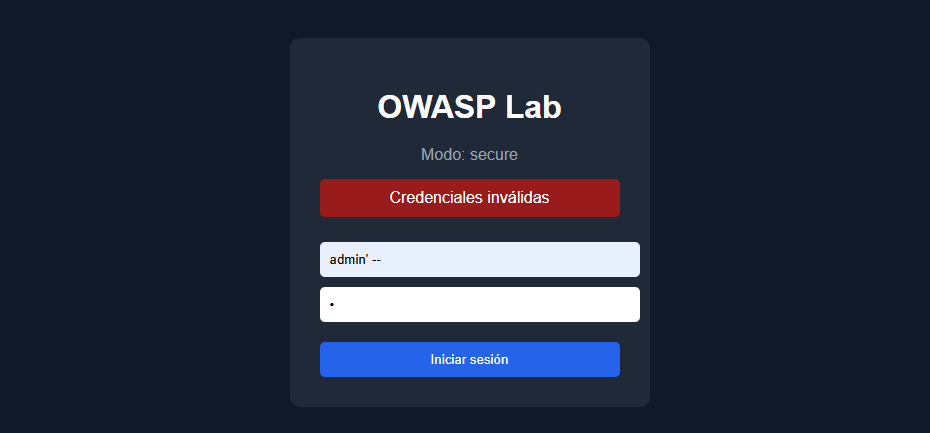
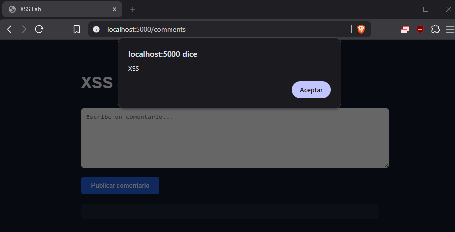
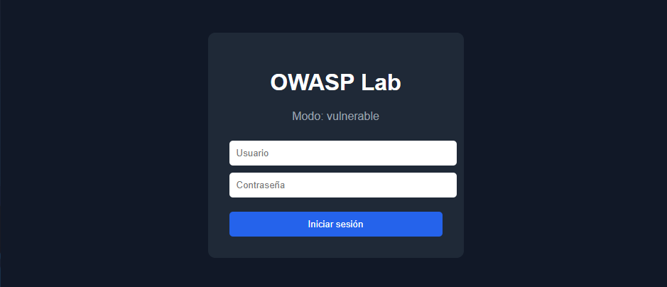
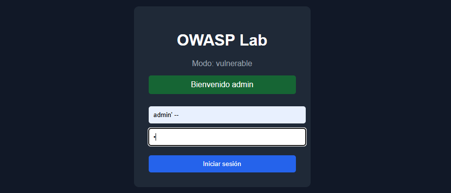
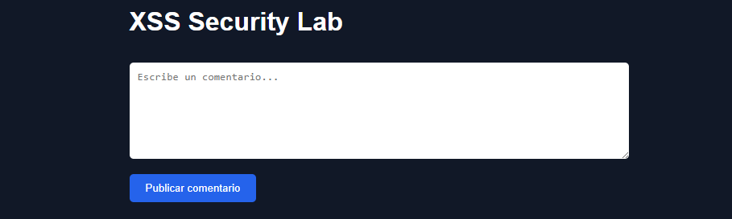
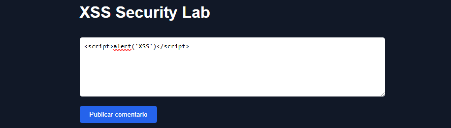
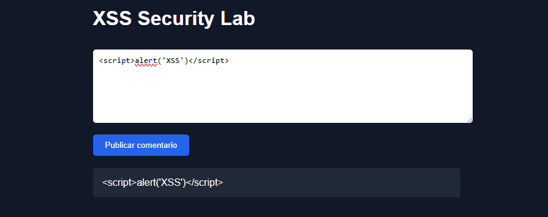

# ◼ Descripción

Laboratorio práctico de ciberseguridad orientado a demostrar vulnerabilidades incluidas en el OWASP Top 10 y su mitigación mediante buenas prácticas de desarrollo seguro.

El proyecto incluye versiones:

- ❌ Vulnerables
- ✅ Seguras

para comparar cómo se explotan y cómo se corrigen diferentes vulnerabilidades web.

---

# ⚠ Vulnerabilidades implementadas ⚠ 

## 🔴 SQL Injection (SQLi)

Demostración de bypass de autenticación mediante concatenación insegura de consultas SQL.

### Payload utilizado

```text
username: admin' --
password: x
```

### Resultado vulnerable


### ✔ Mitigación aplicada

Uso de consultas parametrizadas (prepared statements):

```
cursor.execute(
    "SELECT * FROM users WHERE username = ? AND password = ?",
    (username, password)
)
```

## 🔴 Cross-Site Scripting (XSS)

Demostración de ejecución de JavaScript mediante renderizado inseguro de comentarios.

```
<script>alert('XSS')</script>
```

### Resultado vulnerable



### ✔ Mitigación aplicada

Eliminación del renderizado inseguro mediante |safe en Jinja2:

```
{{ comment }}
```

---

## ◼ Características

- Aplicación web desarrollada con Flask
- Base de datos SQLite
- Interfaz visual de login
- Sistema de comentarios vulnerable a XSS
- Entorno Dockerizado
- Modos seleccionables:
  - 🔴 vulnerable
  - 🟢 secure
- Demostración práctica de vulnerabilidades OWASP
- Mitigación segura aplicada

---

## ◼ Ejecución del proyecto

### Modo vulnerable

```bash
APP_MODE=vulnerable docker compose up --build
```

### Modo seguro

```bash
APP_MODE=secure docker compose up --build
```

## ◼ Endpoint disponible

### Login

```bash
POST /login
```

 Parámetros:

- username
- password

### Comentarios (XSS)

```bash
- GET /comments
- POST /comments
```

## ◼ Tecnologías utilizadas

- Python
- Flask
- SQLite
- HTML/CSS
- Docker
- Docker Compose
- Git

## ◼ Objetivo del proyecto

Proyecto orientado al aprendizaje práctico de:

- OWASP Top 10
- Desarrollo seguro
- Vulnerabilidades web
- Mitigación de ataques comunes
- Docker y entornos reproducibles
- Seguridad en aplicaciones web

## ◼ Capturas

### Página de login


### SQL Injection exitosa



### SQL Injection mitigada


### Página de Comentarios



### XSS vulnerable




### XSS mitigado


## ◼ Autor

Desarrollado por Juan Jesús como proyecto práctico de aprendizaje en ciberseguridad ofensiva y desarrollo seguro.


